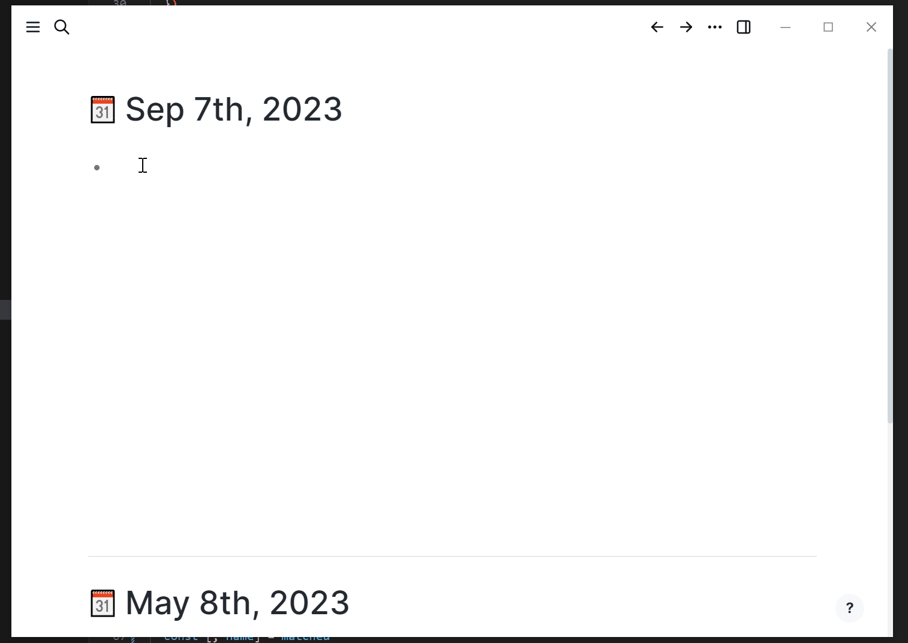

# Logseq MHTML/HTML View Plugin 🚀

Store and load MHTML or HTML file in Logseq!

**NOTE**

for imported file name is used for css id selector, file name imported may be transformed in the proper way.

## Features

- import MTHML or HTML files
- open MHTML or HTML file in Logseq
- add marks

## How to get started
1. Clone the repository or use the button "Use this template" on GitHub to create your own version of the repository 🔨
2. Make sure you have pnpm installed, [install](https://pnpm.io/installation) if necessary 🛠
3. Execute `pnpm install` 📦
4. Change the plugin-name in `package.json` to your liking. Adapt both the package-name and the plugin-id at the bottom of the `package.json`. Make sure that they are not conflicting with plugins you already installed. 📝
5. Execute `pnpm build` to build the plugin 🚧
6. Enable developer-mode in Logseq, go to plugins, select "Load unpacked plugin" 🔌
7. Select the directory of your plugin (not the `/dist`-directory, but the directory which includes your package.json) 📂
8. Enjoy! 🎉
